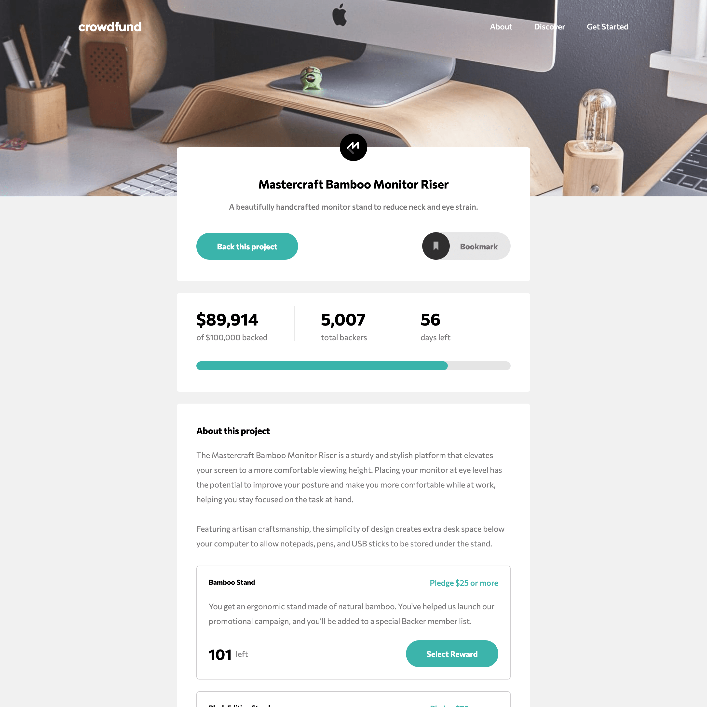

# Crowdfund

A product page for a fictional crowdfunding service

## Hi ! 👋

**Thanks for checking out this [project](https://davidyvon.github.io/crowdfund-product-page/) !**

## General info

- Mobile First Responsive Design
- Mobile menu
- Bookmark toggle option
- Select a reward, enter your pledge and watch the backing informations update

## Built with

      

## Want to see more ?

**Check out my [portfolio](https://www.davidyvon.com) !**
